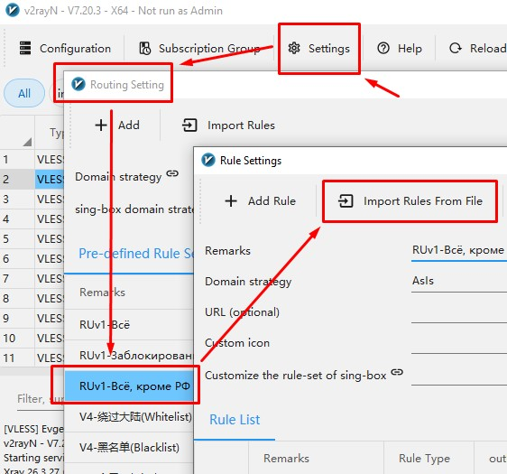

**Конфиг предназначен для работы в v2rayN с раздельной маршрутизацией трафика.**

***

В данной сборке настроен прямой выход для сервисов, которым желательно работать без прохождения через VPN-туннель:
Yandex Music
Yandex Disk
Bitrix24
Microsoft login / Power BI и связанные служебные адреса

Остальной трафик по умолчанию продолжает идти через основной proxy-маршрут.

**Такой вариант нужен для того, чтобы:**
снизить лишнюю нагрузку на VPN-сервер
улучшить стабильность авторизации в Microsoft-сервисах
обеспечить корректную работу Яндекс-приложений
сохранить обычную работу Bitrix24 без ненужного обхода через туннель

Конфиг рассчитан на использование в v2rayN под Windows.
При необходимости для некоторых приложений может потребоваться запуск v2rayN от имени администратора и дополнительная проверка в режиме TUN.

***

## Как тестировать:

1. Импортировать JSON как новый routing profile
2. Перезапустить v2rayN
3. Запустить от имени администратора
4. Сначала проверить без TUN, в режиме прокси
5. Если приложение Яндекс Музыка или Power BI все равно не ловятся, включить TUN и протестировать еще раз
6. Не переключать системный прокси туда-сюда во время теста

## Как импортировать пресет

1. Откройте **v2rayN**
2. Перейдите в **Routing Settings**
3. Нажмите **Add Rule**
4. Нажмите **Import Rules From File**
5. Выберите JSON-файл пресета
6. Подтвердите импорт
7. Выберите импортированный профиль маршрутизации в главном окне v2rayN

  

***

**v2rayN Split routing presets:**
Ready-to-import split routing presets for v2rayN on Windows. Route Yandex, Bitrix24, Microsoft login and Power BI directly while keeping other traffic on proxy.
These are popular Russian services widely used in Russia, so I do not believe they require any additional explanation in English.
